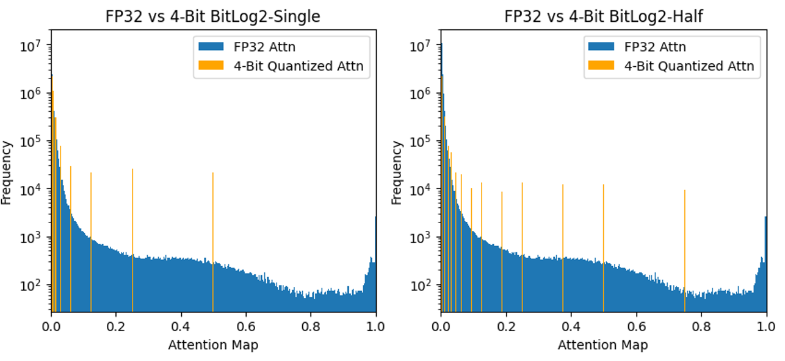

## (BETA) submission for 2024년도 추계종합학술발표회(KICS Fall conference 2024)

- Not yet accepted for publication.

# BitLog2: A Log-Based 4-Bit Quantization for Attention Map Using Bit Shifting



- The Log2-based quantization method for attention maps using only bit shift operations.
- This experiment modifies only the quantization method of the attention map in the W4A4 quantization applied in [RepQ-ViT, CVPR2023](https://github.com/zkkli/RepQ-ViT).
- (Left) BitLog2-single: Compute only integer part of log2(x) values using bit shift operations.
- (Right) BitLog2-half: Addtionally, Separate decimal part of log2(x) values into half using bit shift operations.

## Abstract (English)

Quantization of deep learning models is a technique that enables more efficient inference in environments with limited computing resources, and active research is ongoing in Vision Transformers as well. Particularly for attention maps, quantization methods based on logarithmic functions, which leverage the distribution characteristics of the values, have become mainstream. In the case of RepQ-ViT, quantization is designed under the premise that the logarithmic values are computed accurately up to the fractional part, which necessitates floating-point operations, making it difficult to apply in computing environments that only support integer operations. This paper proposes a quantization method called BitLog2, which calculates the log2 values of attention maps using only bit shift operations. Experimental results show that this method achieves slightly improved accuracy compared to RepQ-ViT, while excluding floating-point operations, thus addressing the mentioned limitations and achieving further advancements.

## Abstract (Korean)

딥러닝 모델의 양자화는 컴퓨팅 리소스가 제약적인 환경에서 보다 원활한 추론을 가능케하는 기술이며, 비전 트랜스포머에서도 관련 연구가 활발히 진행되고 있다. 특히 어텐션 맵 (attention map)에 대해서는 값의 분포 특성을 바탕으로, 로그 수식에 기반한 양자화 방법이 주류를 이룬다. RepQ-ViT의 경우, 로그 수식 값을 소수부까지 정확히 구한다는 전제 하에 양자화가 설계됨에 따라, 부동소수점 연산이 불가피하므로 정수 연산만을 지원하는 컴퓨팅 환경에서 적용이 어렵다. 본 논문은 어텐션 맵의 양자화에서 비트 시프트 연산만으로 log2의 값을 구한 양자화 방법 BitLog2를 제시한다. 실험결과 부동소수점 연산을 배제하면서도 RepQ-ViT 보다 소폭 향상된 정확도까지 얻었으므로, 언급한 제약조건을 해소하면서 발전을 이루었다.

## Evaluation

- Our experiments are based on RepQ-ViT, CVPR2023, and we replaced only the quantization method for the attention map.
- Below are the instructions for reproducing the classification results of BitLog2.
- You can quantize and evaluate a single model using the following command:

```bash
python test_quant.py [--model] [--dataset] [--w_bit] [--a_bit]

optional arguments:
--model: Model architecture, the choises can be:
    vit_small, vit_base, deit_tiny, deit_small, deit_base, swin_tiny, swin_small.
--dataset: Path to ImageNet dataset.
--w_bit: Bit-precision of weights, default=4.
--a_bit: Bit-precision of activation, default=4.
--log_quant_scheme: Log Quantization Method, default=Sqrt2_17 from RepQ-ViT.
    Sqrt2_17, BitLog2_Single_17, BitLog2_Half_16, BitLog2_Half_17
```

- Example: Quantize _DeiT-S_ at W4/A4 precision:

```bash
python test_quant.py --model deit_small --dataset <YOUR_DATA_DIR> --log_quant_scheme BitLog2_Half_17
```

## Results

Below are the experimental results of our proposed BitLog2 that you should get on ImageNet dataset.

| Model  | FP32  | RepQ-ViT | Single_17 |  Half_17   | Half_16 |
| :----: | :---: | :------: | :-------: | :--------: | :-----: |
| ViT-S  | 81.39 |  65.05   |  64.456   | **65.874** | 64.580  |
| ViT-B  | 84.54 |  68.48   |  66.824   | **68.900** | 67.482  |
| DeiT-T | 72.21 |  57.43   |  57.096   | **58.346** | 57.664  |
| DeiT-S | 79.85 |  69.03   |  68.716   | **69.554** | 69.432  |
| DeiT-B | 81.80 |  75.61   |  75.482   | **75.836** | 75.554  |

## Acknowledgement

This experiment is based on the [RepQ-ViT, CVPR2023](https://github.com/zkkli/RepQ-ViT).
Thanks to the author (zkkli) for providing the codebase.

<!-- | Swin-T (81.35) | W4/A4 |  72.31   | W6/A6 |  80.69   | -->
<!-- | Swin-S (83.23) | W4/A4 |  79.45   | W6/A6 |  82.79   | -->

<!-- ## Citation

We appreciate it if you would please cite the following paper if you found the implementation useful for your work:

```bash
@inproceedings{li2023repq,
  title={Repq-vit: Scale reparameterization for post-training quantization of vision transformers},
  author={Li, Zhikai and Xiao, Junrui and Yang, Lianwei and Gu, Qingyi},
  booktitle={Proceedings of the IEEE/CVF International Conference on Computer Vision},
  pages={17227--17236},
  year={2023}
}
``` -->
